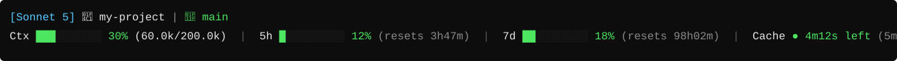

[🇧🇷 Português](README.md) | [🇺🇸 English](README.en.md) | 🇪🇸 Español | [🇨🇳 中文](README.zh.md) | [🇯🇵 日本語](README.ja.md)

# Barra de Estado de Claude Code

Barra de estado de dos líneas para [Claude Code](https://claude.com/claude-code) que muestra modelo, carpeta, rama de git y barras de uso con color para la ventana de contexto, el límite de 5 horas y el límite de 7 días.



Las barras se ponen verdes por debajo de 70%, amarillas entre 70-89% y rojas a partir de 90%.

### Indicador de caché

Al final de la segunda línea aparece el estado de la caché de prompt de la última llamada a la API:

- `Cache ● 4m12s left (5m) 92% hit` — tiempo restante antes de que la caché expire, el TTL en uso (5 minutos o 1 hora) y cuánto del input se leyó de la caché.
- Verde mientras quede más del 20% del TTL, amarillo cuando está por expirar y `● cold` en rojo cuando ya expiró (tu próximo mensaje volverá a procesar todo el contexto).

El tiempo se estima a partir del transcript de la sesión.

## Requisitos

- Claude Code CLI
- **Windows/macOS/Linux con Python**: usa `statusline-command.py` (necesita Python 3, sin paquetes extra)
- **macOS/Linux sin Python**: usa `statusline-command.sh` (necesita `bash`, `jq`, `git`, `awk`)

## Instalación

1. Descarga `statusline-command.py` (o `.sh`) de esta carpeta.
2. Colócalo en la carpeta de configuración de Claude Code: `~/.claude/statusline-command.py`
3. Abre `~/.claude/settings.json` (créalo si no existe) y añade:

**Versión Python:**
```json
{
  "statusLine": {
    "type": "command",
    "command": "python ~/.claude/statusline-command.py"
  }
}
```

**Versión Bash:**
```json
{
  "statusLine": {
    "type": "command",
    "command": "bash ~/.claude/statusline-command.sh"
  }
}
```

4. En Windows, `python` debe estar en el PATH (o usa `py`/ruta completa, ej: `"command": "python C:\\Users\\<tu>\\.claude\\statusline-command.py"`).
5. Reinicia Claude Code. La barra de estado aparece en la parte inferior de la terminal.

Si `settings.json` ya tiene otras claves, solo combina el bloque `statusLine` — no sobrescribas el resto del archivo.

## Desinstalar

Elimina el bloque `statusLine` de `settings.json` (o borra el archivo entero si solo tenía esa clave) y reinicia Claude Code.
