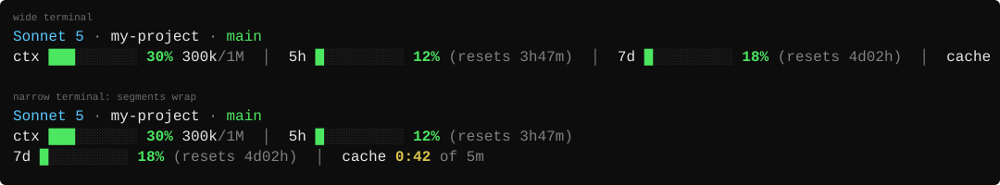

🇧🇷 Português | [🇺🇸 English](README.en.md) | [🇪🇸 Español](README.es.md) | [🇨🇳 中文](README.zh.md) | [🇯🇵 日本語](README.ja.md)

# Status Line do Claude Code

Barra de status de duas linhas para o [Claude Code](https://claude.com/claude-code) mostrando modelo, pasta, branch do git e barras coloridas de uso: janela de contexto, limite de 5 horas e limite de 7 dias.



Os números ficam verdes abaixo de 70%, amarelos entre 70-89% e vermelhos a partir de 90%. `(resets 3h47m)` é quando aquele limite reseta.

A status line se ajusta à largura do terminal. Conforme a janela estreita, os segmentos quebram para uma nova linha. Se ainda não couberem em duas linhas, ela esconde as barras e depois os tempos de reset.

### Indicador de cache

O último segmento mostra o cache de prompt da conversa principal:

- `cache 47m of 1h`: tempo até o cache esfriar e o TTL em uso.
- Verde enquanto resta mais de 20% do TTL, amarelo perto de expirar e `cold` em vermelho depois que expirou. Quando frio, mostra também quantos tokens a próxima mensagem vai gravar de novo no cache (`cold · 73k to rewrite`).

O Claude Code escolhe o TTL por requisição: **1 hora** na assinatura Claude dentro do uso do plano, **5 minutos** quando você está usando créditos (uso extra), chave de API ou provedor de nuvem, ou quando define `FORCE_PROMPT_CACHING_5M=1` / `promptCacheTtl: "5m"`. Gravar no cache de 5 minutos custa 1,25x o preço de input e no de 1 hora custa 2x; leituras do cache custam 0,1x ou menos. Veja [How Claude Code uses prompt caching](https://code.claude.com/docs/en/prompt-caching#cache-lifetime).

O script lê os dados `prompt_cache` do próprio Claude Code (v2.1.251+). Em versões mais antigas, estima a partir do transcript da sessão.

## Requisitos

- Claude Code CLI
- **Windows/macOS/Linux com Python**: use `statusline-command.py` (precisa de Python 3, sem pacotes extras)
- **macOS/Linux sem Python**: use `statusline-command.sh` (precisa de `bash`, `jq`, `git`, `awk`)

## Instalação

1. Baixe `statusline-command.py` (ou `.sh`) desta pasta.
2. Coloque na pasta de configuração do Claude Code: `~/.claude/statusline-command.py`
3. Abra `~/.claude/settings.json` (crie se não existir) e adicione:

**Versão Python:**
```json
{
  "statusLine": {
    "type": "command",
    "command": "python ~/.claude/statusline-command.py"
  }
}
```

**Versão Bash:**
```json
{
  "statusLine": {
    "type": "command",
    "command": "bash ~/.claude/statusline-command.sh"
  }
}
```

4. No Windows, `python` precisa estar no PATH (ou use `py`/caminho completo, ex: `"command": "python C:\\Users\\<voce>\\.claude\\statusline-command.py"`).
5. Reinicie o Claude Code. A status line aparece na parte inferior do terminal.

Se o `settings.json` já tiver outras chaves, só mescle o bloco `statusLine` — não sobrescreva o resto do arquivo.

## Desinstalar

Remova o bloco `statusLine` do `settings.json` (ou apague o arquivo inteiro se só tinha essa chave) e reinicie o Claude Code.
